# Kiến trúc Hệ thống Toàn diện LEAF_AI (ARCHITECTURE DEEP DIVE)

Tài liệu này phân tích chi tiết toàn bộ kiến trúc đa tầng (Multi-tier Architecture) của nền tảng **LEAF_AI** từ góc nhìn người dùng, luồng điều khiển, cho đến các thành phần mã nguồn ở tầng sâu nhất.

---

## 1. Sơ đồ Kiến trúc Tổng thể Đa tầng (Layered Architecture Diagram)

```mermaid
graph TB
    subgraph Presentation_Layer["1. PRESENTATION LAYER (React 18 + Vite + TypeScript)"]
        UI_Home["HomePage (Hero, Stats, Quick Actions)"]
        UI_Diag["DiagnosePage (Upload/Camera, BBox Canvas, Multi-disease Cards)"]
        UI_Lib["DiseaseLibraryPage & DiseaseDetailPage (Knowledge Base)"]
        UI_Care["CarePage (IPM Protocol & Treatments)"]
        UI_Hist["HistoryPage (Diagnosis Log & Records)"]
        UI_SafeImg["SafeImage & 3D Shaders (WebGL/Three.js)"]
        API_Client["Frontend API Client (services/api.ts)"]
    end

    subgraph Transport_Layer["Vite Reverse Proxy (vite.config.ts)"]
        Proxy_API["/api -> http://127.0.0.1:8000/api"]
        Proxy_Uploads["/uploads -> http://127.0.0.1:8000/uploads"]
    end

    subgraph API_Layer["2. APPLICATION & API LAYER (FastAPI)"]
        Router_Main["FastAPI Router (app/main.py)"]
        EP_Health["GET /api/health (app/api/endpoints/health.py)"]
        EP_Predict["POST /api/predict (app/api/endpoints/predict.py)"]
        EP_History["GET, DELETE /api/history (app/api/endpoints/history.py)"]
        EP_Diseases["GET /api/diseases, /api/diseases/{id} (app/api/endpoints/diseases.py)"]
        EP_Care["GET /api/care/{disease_id} (app/api/endpoints/care.py)"]
    end

    subgraph Logic_Layer["3. BUSINESS LOGIC LAYER (Services)"]
        Svc_Pred["PredictionService (app/services/prediction_service.py)"]
        Schema_Validation["Pydantic Schemas Validation (app/schemas/*)"]
        Img_Processor["Image IO & Storage (app/utils/image.py)"]
    end

    subgraph AI_Layer["4. AI / ML INFERENCE LAYER (Ultralytics YOLOv8 & PyTorch)"]
        Svc_BaseModel["BaseModelService (Abstract Base Class)"]
        Svc_YOLO["YOLOModelService (Singleton in Memory)"]
        Model_V3_Weights["Model Weights (model/tomato_v3/best.pt - 640x640)"]
        Model_V2_Weights["Backup Weights (model/tomato_v2/best.pt - 384x384)"]
    end

    subgraph Data_Layer["5. DATA LAYER (SQLAlchemy + SQLite)"]
        DB_Session["SessionLocal & Engine (app/database/session.py)"]
        Model_Disease["Disease Table (app/database/models.py)"]
        Model_Care["CareRecommendation Table (app/database/models.py)"]
        Model_History["DiagnosisHistory Table (app/database/models.py)"]
        DB_File["SQLite Database File (backend/leafai.db)"]
    end

    subgraph Training_Layer["6. OFFLINE TRAINING & RESEARCH PIPELINE"]
        Dataset_Raw["Raw Datasets (training/datasets/raw/)"]
        Dataset_Proc["YOLO Datasets (training/datasets/processed/)"]
        Train_Scripts["Training Scripts (training/scripts/train_tomato_v3.py)"]
        Audit_Tools["Annotation & Audit Scripts (training/scripts/audit_*.py)"]
    end

    %% Connections
    UI_Diag --> API_Client
    UI_Lib --> API_Client
    UI_Care --> API_Client
    UI_Hist --> API_Client
    
    API_Client --> Transport_Layer
    Transport_Layer --> API_Layer
    
    EP_Predict --> Svc_Pred
    EP_History --> DB_Session
    EP_Diseases --> DB_Session
    EP_Care --> DB_Session

    Svc_Pred --> Img_Processor
    Svc_Pred --> Svc_YOLO
    Svc_Pred --> DB_Session
    
    Svc_YOLO -.implements.-> Svc_BaseModel
    Svc_YOLO --> Model_V3_Weights
    
    DB_Session --> Model_Disease
    DB_Session --> Model_Care
    DB_Session --> Model_History
    Model_Disease --> DB_File
    Model_Care --> DB_File
    Model_History --> DB_File

    Train_Scripts --> Model_V3_Weights
```

---

## 2. Phân tích Trách nhiệm Chi tiết Từng Layer

### 2.1. Presentation Layer (Tầng Trình diễn & Trải nghiệm)
- **Công nghệ chính**: React 18, TypeScript, Tailwind CSS, Three.js, Lucide Icons, Material Symbols.
- **Trách nhiệm**:
  - Render giao diện người dùng theo chuẩn phong cách Google Stitch (Digital Canopy Theme, hiệu ứng làm mờ kính Glassmorphism, tone màu xanh tự nhiên).
  - Tiếp nhận tương tác: Chọn file ảnh từ máy tính hoặc chụp trực tiếp qua Webcam/Camera điện thoại.
  - Quản lý trạng thái cục bộ (React Local State): `image`, `analyzing`, `result`, `activeTab`, `error`.
  - Vẽ hộp định vị bệnh (Bounding Boxes) trực quan đè lên ảnh gốc với nhãn màu phân biệt.
  - Phân loại trực quan: Bệnh chính (Primary Disease), Danh sách các đốm bệnh phụ (Additional Detections), Khuyến nghị xử lý (Recommendations).
  - Tự động bắt lỗi và hiển thị ảnh thay thế an toàn khi link ảnh hỏng qua component `SafeImage`.

---

### 2.2. Application & API Layer (Tầng Ứng dụng & Định tuyến API)
- **Công nghệ chính**: FastAPI (Python), Uvicorn ASGI Server, Pydantic Settings, Starlette.
- **Trách nhiệm**:
  - Cung cấp cổng giao tiếp RESTful chuẩn xác định qua đường dẫn tiền tố `/api`.
  - Tiếp nhận HTTP Requests: Multipart Form-Data (cho upload ảnh) và JSON Parameters.
  - Kiểm tra tính toàn vẹn của dữ liệu đầu vào: validate định dạng ảnh (JPG, PNG, WEBP), kích thước file (tối đa 10MB), giải mã ma trận điểm ảnh qua thư viện PIL.
  - Kiểm tra trạng thái máy chủ và mô hình AI qua endpoint `/api/health`.
  - Định tuyến các yêu cầu nghiệp vụ tới tầng Service tương ứng.

---

### 2.3. Business Logic Layer (Tầng Xử lý Nghiệp vụ)
- **File nòng cốt**: [prediction_service.py](file:///c:/Users/Admin/Leaf-Disease-Detection/backend/app/services/prediction_service.py).
- **Trách nhiệm**:
  - Nhận luồng byte ảnh từ API controller, sinh tên file duy nhất bằng UUID và lưu trữ vật lý vào thư mục `backend/uploads/`.
  - Gửi đường dẫn ảnh hoặc luồng byte tới tầng AI Model Service để thực hiện suy luận.
  - Nhận danh sách các phát hiện thô (Raw Detections) bao gồm: tọa độ hộp, độ tin cậy và class ID.
  - **Thuật toán Gom nhóm Đa bệnh (Multi-disease Grouping Logic)**:
    - Nhóm các bounding box cùng loại bệnh lại với nhau.
    - Tìm bệnh có độ tin cậy cao nhất hoặc số lượng đốm bệnh xuất hiện nhiều nhất để gán làm **Bệnh chính (Primary Disease)**.
    - Phân loại mức độ tin cậy theo ngôn ngữ tự nhiên: *Độ tin cậy cao (>70%)*, *Độ tin cậy trung bình (50-70%)*, *Dấu hiệu cần kiểm tra thêm (<50%)*.
  - Truy vấn thông tin bách khoa toàn thư và phác đồ điều trị từ cơ sở dữ liệu dựa trên class bệnh phát hiện được.
  - Tự động khởi tạo và lưu bản ghi lịch sử vào bảng `diagnosis_history`.

---

### 2.4. AI / ML Inference Layer (Tầng Suy luận Trí tuệ Nhân tạo)
- **Công nghệ chính**: Ultralytics YOLOv8, PyTorch, PIL/OpenCV, NumPy.
- **Cấu trúc trừu tượng**:
  - Class trừu tượng [BaseModelService](file:///c:/Users/Admin/Leaf-Disease-Detection/backend/app/services/base_model_service.py) định nghĩa phương thức bắt buộc `predict(image_input, conf_threshold)`.
  - Class thực thi [YOLOModelService](file:///c:/Users/Admin/Leaf-Disease-Detection/backend/app/services/yolo_model_service.py) triển khai tải mô hình `best.pt`.
- **Nguyên lý Tối ưu Bộ nhớ (Memory Lifecycle)**:
  - Mô hình AI **CHỈ ĐƯỢC NẠP 1 LẦN DUY NHẤT VÀO RAM** khi khởi tạo Service (Singleton Pattern).
  - Không nạp lại mô hình qua mỗi request để đảm bảo thời gian phản hồi cực nhanh (chỉ từ **100ms - 350ms** trên CPU).
  - Nhận diện trực tiếp trên độ phân giải gốc **640x640** (Model V3), tự động chuẩn hóa tọa độ hộp bounding box về hệ tọa độ pixel thực của ảnh gốc `(x1, y1, x2, y2)`.

---

### 2.5. Data Layer (Tầng Cơ sở Dữ liệu & Lưu trữ)
- **Công nghệ chính**: SQLite, SQLAlchemy ORM.
- **Trách nhiệm**:
  - Quản lý phiên làm việc cơ sở dữ liệu (`sessionmaker` với `autocommit=False`).
  - Bảng [Disease](file:///c:/Users/Admin/Leaf-Disease-Detection/backend/app/database/models.py): Chứa thông tin khoa học chuyên sâu về bệnh cây: tên khoa học, tác nhân gây bệnh (nấm, vi khuẩn, virus), điều kiện phát sinh, triệu chứng theo 3 giai đoạn (đầu, giữa, nặng), phác đồ phòng trị trước khi trồng và trong khi cây phát triển.
  - Bảng [CareRecommendation](file:///c:/Users/Admin/Leaf-Disease-Detection/backend/app/database/models.py): Lưu các chỉ dẫn thực hành nông nghiệp, biện pháp sinh học, hóa học và mức độ ưu tiên.
  - Bảng [DiagnosisHistory](file:///c:/Users/Admin/Leaf-Disease-Detection/backend/app/database/models.py): Lưu trữ toàn bộ kết quả chẩn đoán của người dùng (URL ảnh, danh sách bounding box JSON, bệnh chính, độ tin cậy, thời gian chẩn đoán).

---

### 2.6. Training & Research Layer (Tầng Nghiên cứu & Huấn luyện Ngoại tuyến)
- **Trách nhiệm**:
  - Quản lý tập dữ liệu hình ảnh bệnh lá cà chua qua 3 giai đoạn phát triển:
    - `tomato` (V1 Baseline): 600 ảnh, 320x320.
    - `tomato_v2` (V2): 384x384, tích hợp ảnh lá khỏe đối chứng (Hard Negatives) nhằm triệt tiêu hoàn toàn hiện tượng nhận diện nhầm lá khỏe thành có bệnh.
    - `tomato_v3` (V3 Production): 640x640, tinh chỉnh chuyên sâu để bắt trọn các đốm bệnh vi khuẩn kích thước cực nhỏ (Recall tăng vọt từ 77% lên 80.8%).
  - Các script Python độc lập phục vụ việc trích xuất nhãn, phân tích tỷ lệ sai sót (False Positives), và xuất weights sang thư mục `model/`.
