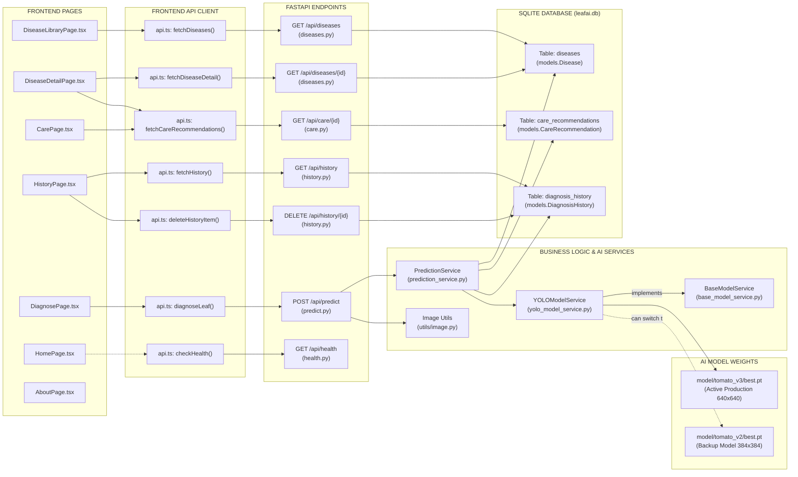
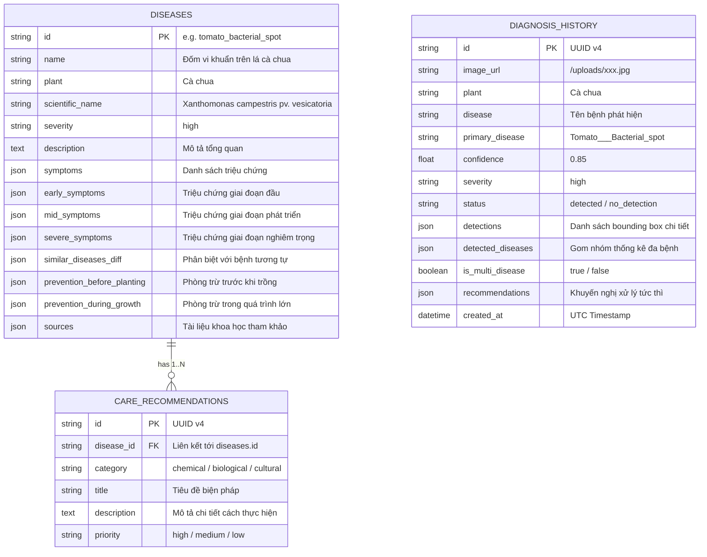

# Sơ đồ Phụ thuộc Module & Dịch vụ (DEPENDENCY MAP)

Tài liệu này cung cấp bản đồ phân cấp phụ thuộc (Dependency Graph) giữa các trang giao diện (Frontend Pages), dịch vụ gọi API (Frontend API Services), bộ điều khiển đầu cuối (Backend Endpoints), tầng xử lý nghiệp vụ (Business Services), tầng mô hình trí tuệ nhân tạo (AI Models) và tầng cơ sở dữ liệu quan hệ (Database Tables).

---

## 1. Sơ đồ Phụ thuộc Module Toàn Hệ thống (End-to-End Dependency Graph)

---

## 2. Bảng Quan hệ Phụ thuộc Chi tiết Từng Module

### 2.1. Tầng Giao diện (Frontend Layer)

| Màn hình | Dịch vụ API được gọi | Endpoint Backend tương ứng | Thành phần Backend xử lý |
|---|---|---|---|
| **DiagnosePage** | `diagnoseLeaf(file, confThreshold)` | `POST /api/predict` | `predict.py` → `prediction_service` → `YOLOModelService` → `leafai.db` |
| **DiseaseLibraryPage** | `fetchDiseases(search, plant)` | `GET /api/diseases` | `diseases.py` → `db.query(Disease)` |
| **DiseaseDetailPage** | `fetchDiseaseDetail(id)` `fetchCareRecommendations(id)` | `GET /api/diseases/{id}` `GET /api/care/{id}` | `diseases.py` → `db.query(Disease)` `care.py` → `db.query(CareRecommendation)` |
| **CarePage** | `fetchCareRecommendations(id)` | `GET /api/care/{id}` | `care.py` → `db.query(CareRecommendation)` |
| **HistoryPage** | `fetchHistory()` `deleteHistoryItem(id)` | `GET /api/history` `DELETE /api/history/{id}` | `history.py` → `db.query(DiagnosisHistory)` `history.py` → `db.delete(item)` |

---

### 2.2. Tầng Xử lý Nghiệp vụ & Mô hình AI (Backend Core & AI Layer)

| Module / Lớp | Kế thừa / Cài đặt Interface | Phụ thuộc vào Modules | Được sử dụng bởi |
|---|---|---|---|
| `BaseModelService` | `abc.ABC` | `abc` | `YOLOModelService`, `MockModelService` |
| `YOLOModelService` | `BaseModelService` | `ultralytics.YOLO`, `torch`, `PIL`, `config.settings` | `prediction_service.py`, `test_yolo_service.py` |
| `PredictionService` | *Singleton Class* | `YOLOModelService`, `models.Disease`, `models.DiagnosisHistory`, `schemas.diagnosis` | `api/endpoints/predict.py` |
| `seed_database` | *Migration Routine* | `sqlalchemy.text`, `models.Base`, `session.engine` | `app/main.py` (Startup Hook) |

---

### 2.3. Tầng Cơ sở Dữ liệu (Database Relationships)

