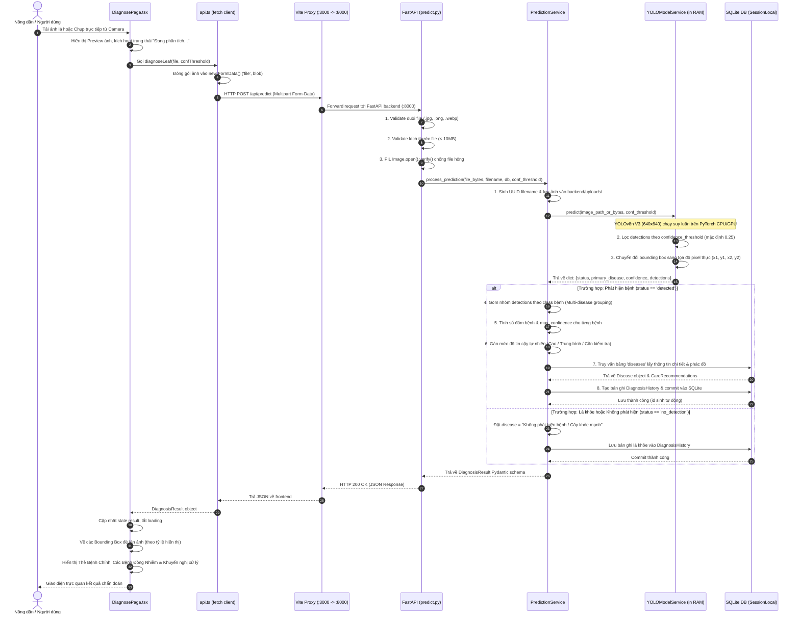
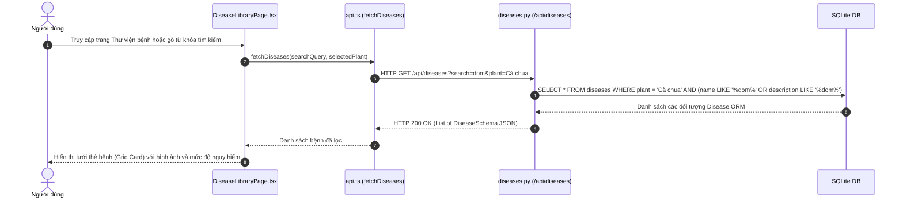
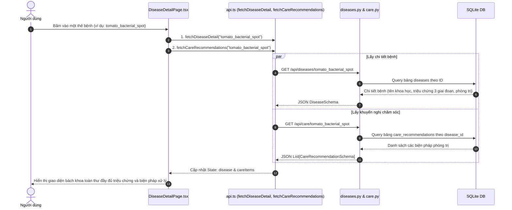
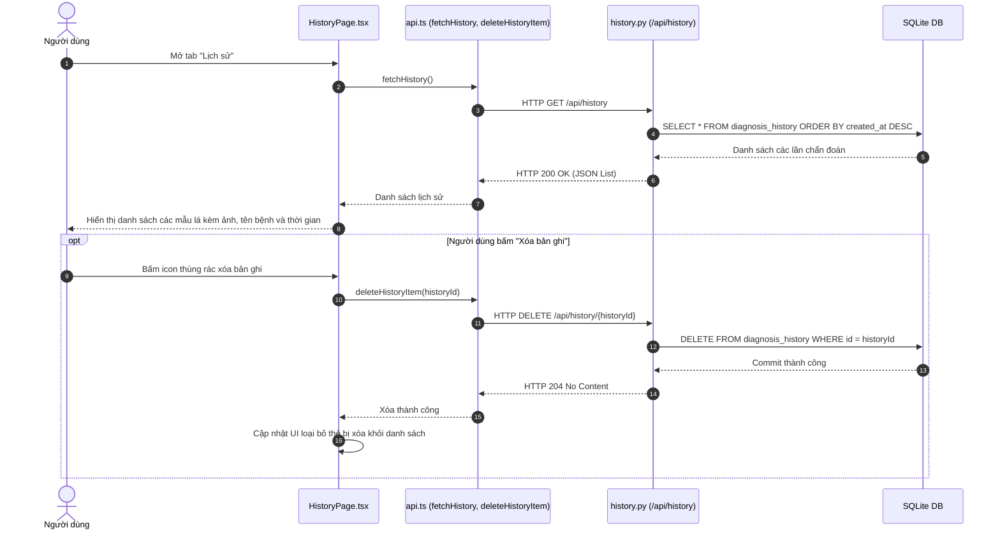

# Luồng Dữ liệu Toàn Hệ thống LEAF_AI (SYSTEM DATA FLOW)

Tài liệu này mô tả chi tiết từng bước luồng dữ liệu (Data Flow) di chuyển qua các tầng của hệ thống **LEAF_AI**: từ tương tác của người dùng trên trình duyệt, qua API Client, Reverse Proxy, FastAPI, Business Logic, AI Inference Model, Cơ sở dữ liệu SQLite, và quay trở lại hiển thị trên giao diện người dùng.

---

## 1. Luồng Chẩn đoán Bệnh Lá (AI Diagnosis Data Flow - Core Flow)

Đây là luồng dữ liệu quan trọng và phức tạp nhất trong toàn bộ hệ thống.

### 1.1. Sơ đồ Tuần tự Chi tiết (Sequence Diagram)

---

### 1.2. Giải thích Chi tiết Từng Bước Chuyển Dịch Dữ liệu

1. **Khởi tạo dữ liệu tại Frontend**:
   - Người dùng bấm nút "Chọn ảnh từ thiết bị" hoặc bấm "Bật camera" để chụp ảnh lá cây.
   - Trình duyệt tạo một đối tượng JavaScript `File` hoặc `Blob`.
   - `URL.createObjectURL(file)` được tạo ngay lập tức để người dùng xem trước (Preview) ảnh trong khi chờ kết quả.
2. **Vận chuyển qua HTTP**:
   - `api.ts` bọc file vào đối tượng `FormData`: `formData.append('file', file)`.
   - Gửi yêu cầu `POST /api/predict` kèm query parameter `?conf_threshold=0.25` nếu người dùng tùy chỉnh.
3. **Tiếp nhận & Phòng vệ tại FastAPI**:
   - FastAPI đọc headers `Content-Type: multipart/form-data`.
   - Kiểm tra định dạng đuôi file trong whitelist: `[".jpg", ".jpeg", ".png", ".webp"]`.
   - Sử dụng thư viện `PIL.Image.open(io.BytesIO(contents)).verify()` để xác thực luồng byte có đúng là ma trận ảnh hợp lệ hay không, ngăn chặn triệt để tấn công upload file giả mạo hoặc file bị lỗi giữa chừng.
4. **Xử lý tại AI Model (YOLOv8n V3)**:
   - Mô hình AI nằm sẵn trong bộ nhớ RAM từ khi khởi động server.
   - Quá trình suy luận tính toán trên tensor ảnh đầu vào chuẩn hóa kích thước 640x640.
   - Đầu ra của mạng nơ-ron là các hộp dự đoán `(x1, y1, x2, y2, confidence, class_id)`.
   - Các hộp có độ tin cậy nhỏ hơn `conf_threshold` sẽ bị loại bỏ hoàn toàn.
   - Các hộp hợp lệ được chuyển đổi sang kích thước ảnh gốc của người dùng.
5. **Gom nhóm nghiệp vụ & Truy vấn Cơ sở Dữ liệu**:
   - `prediction_service.py` tổng hợp các đốm bệnh cùng loại. Ví dụ: Phát hiện 4 đốm `Tomato___Bacterial_spot` (max conf: 0.85) và 1 đốm `Tomato___Early_blight` (conf: 0.42).
   - Xác định bệnh có độ tin cậy cao nhất là `Tomato___Bacterial_spot`.
   - Truy vấn bảng `diseases` với `id = "tomato_bacterial_spot"` để lấy toàn bộ thông tin khoa học, triệu chứng và giải pháp IPM.
6. **Lưu vết Lịch sử (Persistence)**:
   - Một bản ghi `DiagnosisHistory` được tạo với `id` dạng UUID v4, lưu đường dẫn ảnh tĩnh `/uploads/xxx.jpg`, danh sách bounding box và thời gian theo chuẩn UTC.
7. **Hiển thị Phía Trình duyệt (Rendering)**:
   - React nhận JSON trả về từ backend, đối chiếu với interface `DiagnosisResult`.
   - Sử dụng CSS Absolute Positioning kết hợp với tỷ lệ ma trận ảnh để vẽ khung chữ nhật bao quanh từng đốm bệnh trên lá.

---

## 2. Luồng Tra cứu Thư viện Bệnh (Disease Library Data Flow)

---

## 3. Luồng Xem Chi tiết Bệnh & Phác đồ IPM (Disease Detail Data Flow)

---

## 4. Luồng Quản lý Lịch sử Chẩn đoán (History Management Data Flow)

